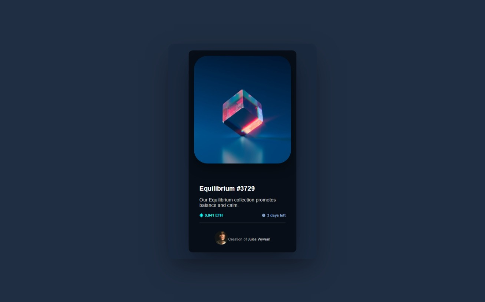

# 💎 NFT Preview Card

Este é um desafio realizado a partir da plataforma [Frontend Mentor](https://www.frontendmentor.io/), com o objetivo de praticar HTML e CSS moderno, incluindo Grid, Flexbox, responsividade e efeitos visuais.

## 🧠 Descrição

Criação de um cartão de visualização de NFT com design moderno, responsivo e foco em boas práticas de HTML semântico e CSS limpo.

O projeto apresenta:
- Imagem principal com efeito de overlay no hover;
- Informações do NFT como nome, descrição, valor e tempo restante;
- Informações do criador com avatar e link;
- Design inspirado na UI do desafio proposto pelo Frontend Mentor.

## 🚀 Tecnologias Utilizadas

- HTML5 semântico
- CSS3 moderno
- Flexbox e CSS Grid
- Responsividade com Media Queries
- Efeitos com `:hover`, `transition`, e `opacity`

## 🎯 Funcionalidades

- Layout responsivo para diferentes tamanhos de tela
- Hover na imagem com overlay e ícone
- Ícones inline com texto para preço e tempo restante
- Avatar com identificação do criador

## 🔗 Link do Projeto

📎 [Visualizar Projeto no Vercel/GitHub Pages](https://nft-preview-component-lemon.vercel.app/)  
📁 [Repositório no GitHub](https://github.com/victorSsx/nft-preview-component)

## 📸 Screenshot

---

## 📚 Créditos

Desafio proposto por [Frontend Mentor](https://www.frontendmentor.io/), adaptado para estudo pessoal por **Victor**.

---

### ✨ Autor

Feito com dedicação por [Victor](https://github.com/victorSsx)

